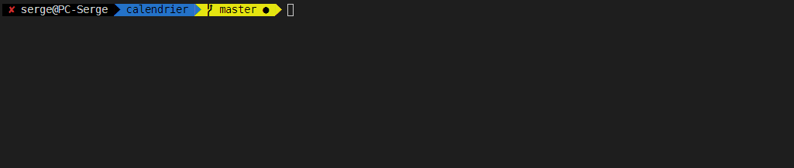
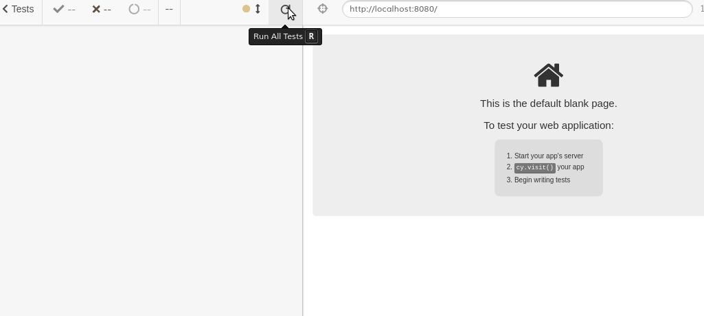

# Calendrier

## Demo

https://sergemazille-test-calendrier.netlify.app/

## Setup du projet

```
npm install
```

### Compile et sert avec hot reload pour le développement

```
npm run serve
```

### Compile et minifie pour la production

```
npm run build
```

### Lance les tests unitaires

```
npm run test
```


### Lance les tests end-to-end

```
npm run test:e2e
```



### Lint les fichiers (avec modification)

```
npm run lint
```
